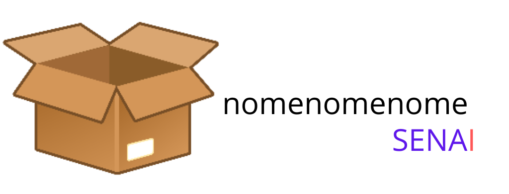
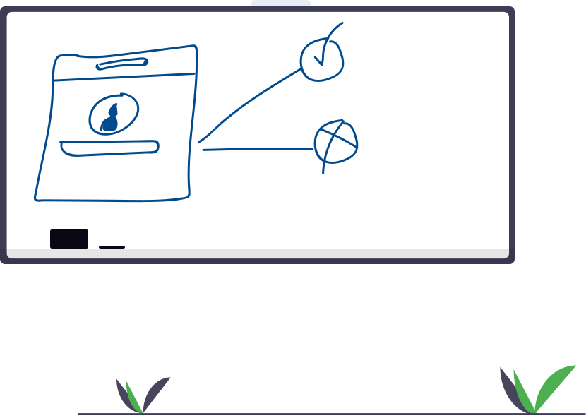
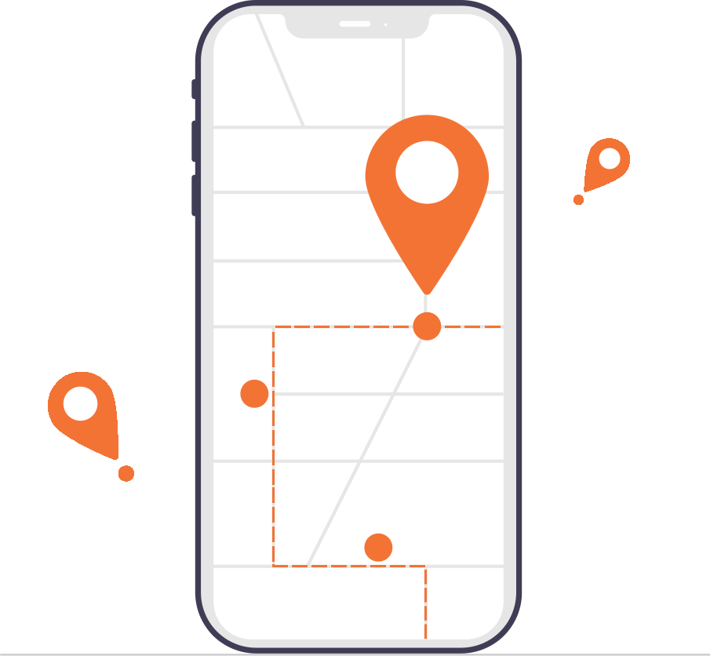
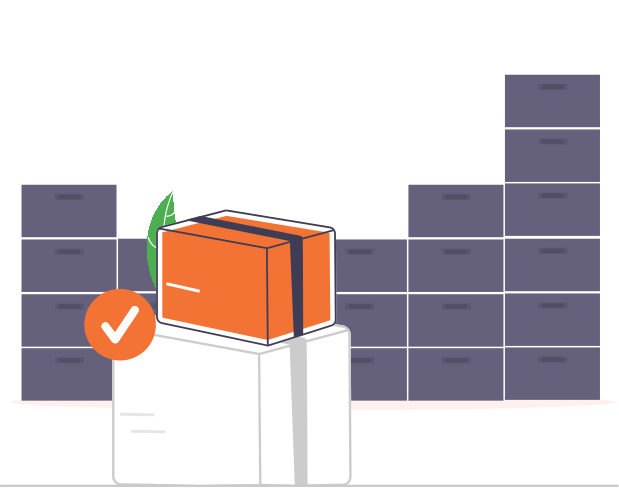

---
hide:
  - navigation
  - toc
  - feedback
---

<h1 class="titulo-centralizado">Central de ajuda MILO</h1>

  

  

***

MILO é um sistema inteligente de logística com foco em estoques, geração de rotas e relatórios estratégicos, visando atender as necessidades de empresas locais. O projeto é uma iniciativa em **colaboração com o [SENAI Alagoas](https://al.senai.br/para-empresas/)**, com foco na **simplicidade, eficiência e organização** dos processos de controle de logística.

**Se você é novo no MILO, comece no [Guia de uso](manual_usuario/index.md).**

***
<h2 class="titulo-centralizado">Navegue</h2>

-   [<h2 class="titulo-centralizado">Guia de uso</h2>](manual_usuario/index.md) 

    ---

    [

](manual_usuario/index.md)

-   [<h2 class="titulo-centralizado">Vendas e Rotas</h2>](manual_usuario/vendas.md)

    ---

    [

](manual_usuario/vendas.md)

-   [<h2 class="titulo-centralizado">Estoques</h2>](manual_usuario/estoques.md)

    ---

    [

](manual_usuario/estoques.md)

-   [<h2 class="titulo-centralizado">Relatórios MILO</h2>](manual_usuario/relatorios.md)

    ---

    [

](manual_usuario/relatorios.md)

-   [<h2 class="titulo-centralizado">Dúvidas Frequentes</h2>](duvidas-frequentes.md)

    ---

    [

](duvidas-frequentes.md)

-   [<h2 class="titulo-centralizado">Conta, Segurança e Privacidade</h2>](manual_usuario/segurança.md)

    ---

    [

](manual_usuario/segurança.md)

