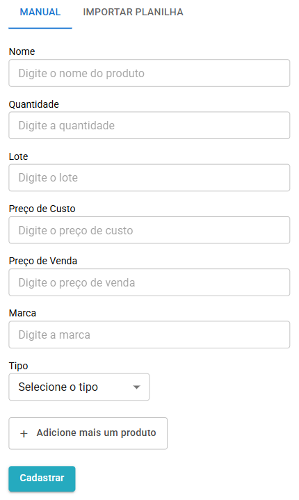

# Estoques
---
## Cadastrando produtos

### Cadastro Manual

__1.__ Acesse o menu Estoque.

__2.__ Preencha os campos com as informações e descrições do produto que você deseja cadastrar.

  

__3.__ Assim que todos os campos estiverem preenchidos, clique em Cadastrar, e seu produto está no sistema!

Também é possível cadastrar diversos produtos simultaneamente ao apertar o botão Adicione mais um produto. 
???+ tip inline end "Dica"
    - Registre todas as suas entradas no estoque, dessa forma você garante [Relatórios de vendas](relatorios.md) atualizados e confiáveis!

---
### Importando Planilhas
<h6>Cadastre em massa!</h6>

__1.__ Ainda na seção Estoques selecione a opção Importar planilha.

__2.__ Em Ver modedelo de planilha você pode baixar o formato aceito pelo sistema.

__3.__ Utilize um editor de planilhas à sua escolha e preencha corretamente todos os campos em branco.

__4.__ Envie a planilha e está feito!

__5.__ Em Ver modedelo de planilha é possível visualizar o formato aceito pelo sistema.

???+ tip "Dica"
    - Atente-se ao formato de arquivo da sua planilha!! MILO suporta apenas planilhas no formato .csv

**gif**

---
## Editando itens no estoque
<h6>Atualize seu estoque quantas vezes forem necessárias!</h6>

__1.__ Acesse o menu Estoque.

__2.__ Selecione a opção Consultar Produtos para acessar todos os itens cadastrados.

__3.__ Pesquise e selecione o produto desejado.

__4.__ Salve as alterações ao término das mudanças.

