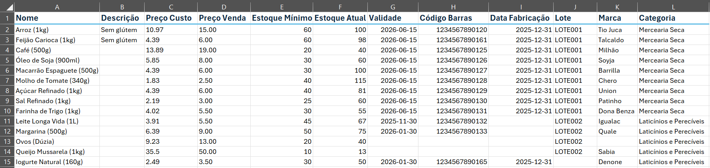

# Cadastrando Produtos
---

## Cadastro Manual

__1.__ Acesse o menu Estoque.

__2.__ Selecione o submenu Cadastro Manual.

__3.__ Preencha os campos com as informações e descrições do produto que você deseja cadastrar.

__4.__ Assim que todos os campos estiverem preenchidos, clique em Cadastrar, e seu produto está no sistema!

???+ tip inline end "Dica"
    - Registre todas as suas entradas no estoque, dessa forma você garante [Relatórios de vendas](relatorios.md) atualizados e confiáveis!

---
## Cadastro por Planilhas
<h6>Cadastre em massa!</h6>

__1.__ Ainda na seção Estoques selecione a opção Cadastro por Planilha.

__2.__ Baixe o modelo da planilha sugerido e aceito pelo sistema.

__3.__ Utilize um editor de planilhas à sua escolha e preencha corretamente todos os campos necessários.

__4.__ Envie o arquivo e está feito!

???+ tip "Dica"  
    

    
    

    
    - Os campos de Descrição, Validade, Data de Fabricação, Lote, Marca e Categoria são opcionais, mas recomendamos fortemente que sejam preenchidos para garantir maior organização ao gerenciamento de produtos. 
    
    - Evite reorganizar ou apagar colunas. Isso poderá gerar erros na importação. 
