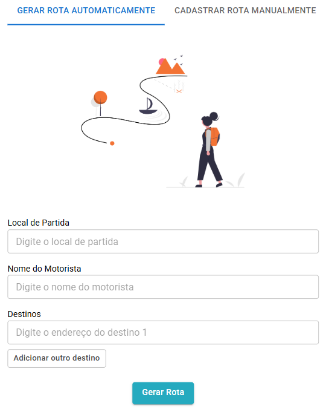
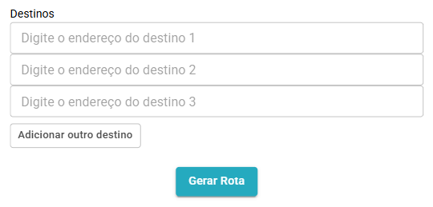

# Gerenciando Rotas
---

  

MILO é capaz de criar a melhor rota para atender as necessidades de seus clientes.

---
## Gerar rota automaticamente

A partir do local de partida e destinos, MILO seleciona a rota mais eficiente, levando em consideração tempo de entrega, distância e trânsito da região. 

Clique em Adicionar outro destino para inserir destinos adicionais a mesma rota de entrega.

Ao término da operação, um link _Google Maps_ será disponibilizado pelo sistema.

## Gerar rota manualmente

## Consultar rotas

Em Consultar rotas é possível acompanhar todas as rotas cadastradas no sistema, além do link do trajeto no **Google Maps**. 