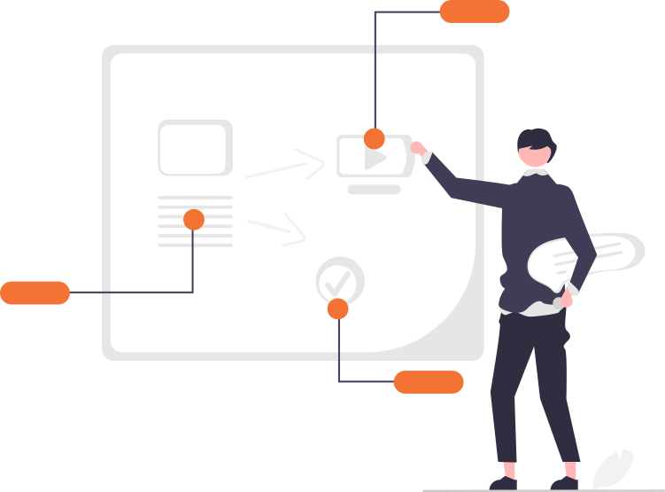

# Manual de usuário
---

  

Bem-vindo à Central de Ajuda do MILO. Aqui você encontrará informações úteis para tirar dúvidas, resolver problemas e aproveitar ao máximo todas as funcionalidades da plataforma.

---

  Olá, como podemos te ajudar?

<form role="search" id="custom-search" style="max-width:800px;margin:2rem auto;display:flex;">
  <input type="search" placeholder="Digite o termo de pesquisa aqui..." style="flex:1;padding:1rem;border-radius:420px 0 0 420px;border:1px solid #ccc;">
  <button type="submit" style="padding:0.5rem 1rem;border-radius:0 420px 420px 0;border:1px solid #ccc;background:#F37335;color:#fff;">Buscar</button>
</form>
---

-   [📦 __Cadastrando seus produtos__](cadastrando-produtos.md)
    
    --- 

    [É fácil como parece!](cadastrando-produtos.md)

    
-   [📦 __Consulte seu estoque__](cadastrando-produtos.md)

-   [📦 __Gerando relatórios__](cadastrando-produtos.md)

-   [🚚 __Gerencie suas rotas__](gerenciando-rotas.md)

    ---
    [Faça suas rotas de entrega com MILO e saia na frente!](gerenciando-rotas.md)

__.__
📌 O que é o MILO?

🛠️ Como usar o sistema?

🔐 Problemas de login ou acesso

📦 Dúvidas sobre estoque

🚚 Dúvidas sobre rotas e entregas

💬 Contato com o suporte

---
## Dúvidas frequentes

??? info "📦 Dúvidas sobre estoque"
    - Como cadastrar um novo produto?
    - Como editar informações do estoque?
    - Como excluir um item?

??? info "🚚 Dúvidas sobre rotas e entregas"
    - Como criar uma nova rota?
    - Como visualizar entregas pendentes?
    - Como editar uma rota existente?

??? info "🔐 Problemas de login ou acesso"
    - Esqueci minha senha, e agora?
    - Não consigo acessar minha conta.
    - Como alterar meu e-mail?

??? info "💬 Contato com o suporte"
    - Como falar com o suporte?
    - Qual o horário de atendimento?

