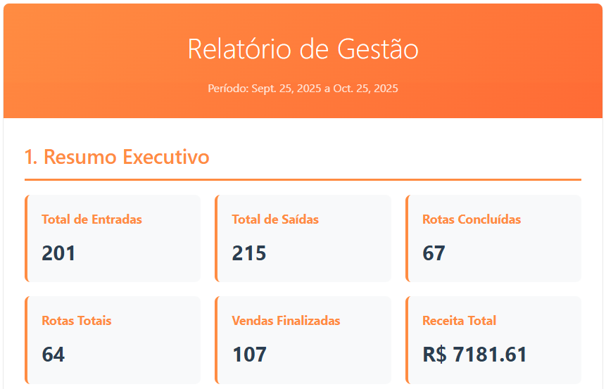

# Relatórios MILO

<h6>MILO gera relatórios periódicos automáticos que ajudam o seu negócio a voar.</h6>
---

  

**Receba acesso a:**

-   __Resumo Executivo__

    ---
    - Receba as Métricas principais do período:
      * Total de saídas, entradas, número de rotas, vendas, e receita total.

-   __Análise de Produtos__

    ---

    - Top entradas, saídas, mais e menos vendidos
    * Te ajuda a definir estratégias para cada produto, como investir, manter, colher ou abandonar um item do portfólio. 
      
-   __Análise de Rotas__

    ---

    - Descubra o seu Top bairros mais visitados, produtos mais e menos enviados.
    

-   __Detalhamento de Rotas__

    ---

    - Tabela completa com custos, vendas, lucros e destinos de entrega.

-   __Detalhamento de Vendas__

    ---

    - Lista todas as suas vendas do período destacando a modalidade de venda.

**Como acessar:**

__1.__ Na tela inicial de MILO, clique no botão Gráficos e Relatórios.

__2.__ Defina intervalo desejado para geração.

__3.__ Aperte o botão Gerar Relatório.