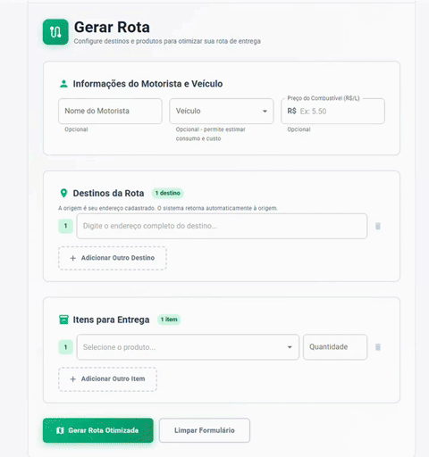

# Rotas e Entregas
---

## Gerar rota automaticamente

__1.__ Acesse o menu Vendas e siga para Entregas.

__2.__ Preencha os campos.

__3.__ Ao terminar o preenchimento, selecione Gerar rota para receber um link _Google Maps_ contendo a melhor rota para sua entrega!

  

???+ tip "Dica"
    - Todas as rotas geradas sempre começam e terminam no endereço do estabelecimento. Caso deseje alterar o endereço de partida, acesse o seu [Perfil de Usuário](perfil.md).

## Cadastrando veículos

__1.__ Acesse o menu Vendas e siga para Veículos.

__2.__ Cadastre todos os veículos afiliados ao estabelecimento, juntamente com os tipo de combustíveis utilizados e a eficiência do veículo.

Esses dados são relevantes para calcular os custos do transposte, fazendo seus [relatórios](relatorios.md) ainda mais precisos.

## Consultando rotas

__1.__ Acesse o menu Rotas.

__2.__ Selecione o submenu Consultar rotas.

__3.__ Nesta seção você tem acesso a todas as informações sobre rotas já cadastradas no sistema, links _Google Maps_, tempo estimado de entrega, e motoristas atribuídos às suas entregas. 