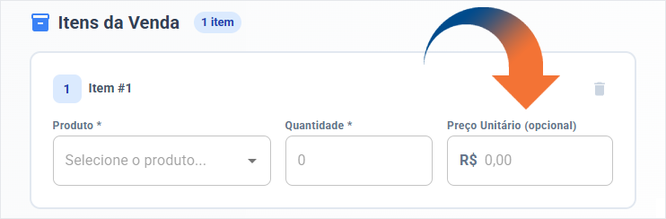

# Cadastro de Vendas
---

__1.__ Acesse o menu Vendas e siga para Cadastro de vendas.

__2.__ Selecione os itens e quantidades a serem vendidas.

__3.__ Finalize a operação selecionando Criar venda.

???+ tip "Dica"
    - MILO conta com uma opção para realizar vendas com preços variáveis.
    

    - Dessa forma, descontos e preços avulsos podem ser aplicados sem precisar editar o valor de todos os itens em estoque.

Obs: A venda só será considerada Finalizada quando a caixinha "Finalizar venda automaticamente" estiver marcada, caso contrário, a venda será considerada pendente, até ser finalizada pelo usuário.